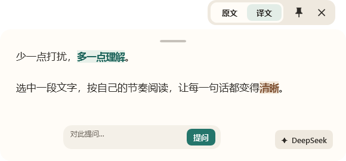
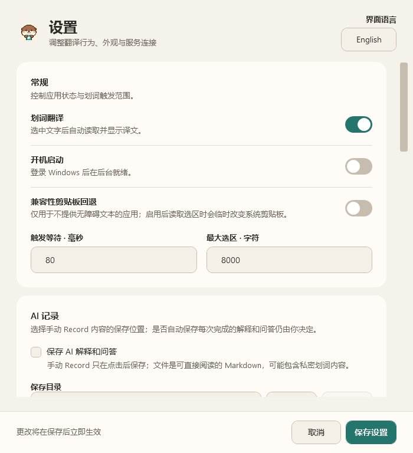
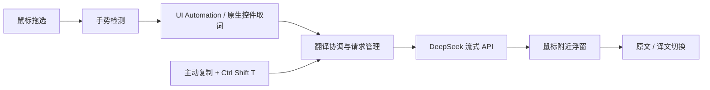

<p align="center">
  
</p>
<h1 align="center">译獭 · Yita</h1>
<p align="center">少一点打扰，多一点理解。<br>面向 Windows 的划词翻译工具，让译文停留在阅读发生的地方。</p>
<p align="center">
  <a href="https://github.com/2214331539/Yita/actions/workflows/build.yml"></a>
  <a href="LICENSE"></a>
  
  
</p>
<p align="center">
  <a href="#快速开始">快速开始</a> · <a href="#使用方式">使用方式</a> · <a href="#配置与数据隐私">配置与数据隐私</a> · <a href="#开发与构建">开发与构建</a> · <a href="#已知限制与排障">已知限制与排障</a>
</p>

Yita 在支持文本选区读取的应用中检测鼠标拖选，通过 DeepSeek 流式返回译文，并在选区附近显示可固定、可调整大小的浮窗。它适合阅读英文网页、可选中文字的 PDF、Markdown 和编辑器中的文本。

**当前状态：** Windows 桌面开发版本。仓库提供源码和构建脚本；本文不承诺已经提供可下载的安装包。当前没有 Setup 安装器、自动更新或 macOS/Linux 版本。在线翻译需要自行配置 API Key，调用费用由所用 API 服务计费。

## 界面预览

<p align="center">
  
</p>

<details>
<summary>查看设置界面</summary>
<p align="center">
  
</p>
</details>

以上为当前 WPF 界面渲染的静态示例，使用演示文案，不包含用户文档或真实 API 请求结果。实际显示受系统缩放、字体和所选主题影响。

## 核心功能

| 功能 | 当前行为 |
| --- | --- |
| 自动划词 | 鼠标拖选后检测选区；优先使用 UI Automation 和原生控件接口读取文字 |
| 流式翻译 | 逐步显示服务返回的译文，支持取消、超时处理与请求并发控制 |
| 原文 / 译文 | 顶部分段按钮切换阅读内容；查看原文时译文继续在后台接收 |
| 轻量浮窗 | 顶部只显示原文、译文、固定和关闭；支持拖动、边缘缩放与长文滚动 |
| 剪贴板翻译 | 用户主动复制后，按 `Ctrl+Shift+T` 翻译当前剪贴板 |
| 阅读偏好 | 中英文字体、字号、翻译方向、表达风格、个人术语表及可选上下文 |
| 后续提问 | 浮窗底部可围绕当前内容提问，或进入 DeepSeek 快速聊天 |
| 托盘控制 | 启用 / 暂停划词、打开设置、翻译剪贴板、修复划词捕获和退出 |
| 可选记录 | 手动保存记录；自动保存 AI 解释与问答默认关闭 |
| 中英文界面 | 设置页可切换中文 / English |

原有工具栏的翻译方向、解释、代码分析、复制和编辑按钮已隐藏。部分能力仍在内部逻辑、快捷键或正文交互中保留；顶部“原文 / 译文”用于切换显示，不是复制按钮。

### 以阅读为先的外观

默认主题 **「译獭 · 湖畔」** 来自水獭形象的奶油白、暖棕和湖水绿：

- 阅读面使用接近白色的奶油白 `#FFFCF7`，正文为深暖灰 `#302D29`。
- 湖水绿 `#24756B` 用于主操作，暖棕只承担少量内容强调。
- 默认主题的正文对比度约 **13.4:1**，辅助文字约 **5.5:1**；自定义主题需自行评估对比度。
- 默认字体为 Segoe UI 与 Microsoft YaHei UI；没有捆绑 Apple 的专有字体。
- 窗口淡入、按钮按压、开关滑动和阅读切换采用短时过渡，并遵循 Windows 客户区动画与高对比度设置。
- 玻璃样式的正文使用不透明阅读面，避免桌面细节穿透文字区域；外层透明效果不等于系统实时背景模糊。

## 快速开始

### 环境要求

| 使用方式 | 要求 |
| --- | --- |
| 从源码构建 | Windows 10/11、Git、[.NET 8 SDK](https://dotnet.microsoft.com/download/dotnet/8.0) |
| 运行依赖运行时的构建 | Windows 10/11、.NET 8 **Desktop Runtime**，架构与程序一致 |
| 运行自行生成的自包含包 | 发布脚本目标为 Windows x64，无需单独安装 .NET |
| 使用在线翻译 | 网络连接、有效 API Key，以及服务支持的模型名称 |

WPF 依赖 Windows。当前不支持把本项目直接编译为 macOS 或 Linux 桌面应用，也未验证 Windows ARM64 的兼容性。

### 从源码运行

在 Windows PowerShell 中执行：

```powershell
git clone https://github.com/2214331539/Yita.git
cd Yita
dotnet restore .\Yita.sln
dotnet build .\Yita.sln --configuration Release --no-restore
dotnet run --project .\src\Yita.App\Yita.App.csproj --configuration Release --no-build
```

已有 SSH 配置时，也可使用 `git@github.com:2214331539/Yita.git` 克隆。

### 首次配置

1. 退出其他正在运行的 Yita / 旧版翻译程序，避免划词监听与快捷键冲突。
2. 打开设置，可在右上角切换中文界面。
3. 选择 DeepSeek 服务，填写 API Key、服务地址及模型名称。默认服务地址为 `https://api.deepseek.com`；模型以你的服务账号实际支持的名称为准。
4. 点击测试连接，成功后保存设置。API Key 不随源码提供。
5. 先在记事本或普通网页中拖选一段英文，确认浮窗出现。

Yita 自带用于开发的 Mock 翻译提供器，可在不调用在线服务的情况下检查取词与展示流程；其输出不是实际翻译。

## 使用方式

| 操作 | 方法 |
| --- | --- |
| 自动翻译 | 在支持的应用中用鼠标拖选文字 |
| 翻译剪贴板 | 自己先按 `Ctrl+C`，再按全局快捷键 `Ctrl+Shift+T`，或使用托盘菜单 |
| 切换阅读内容 | 点击浮窗顶部“原文 / 译文” |
| 复制正文 | 点击正文后选中文字，使用 `Ctrl+C` 或右键菜单 |
| 固定 / 取消固定 | 点击图钉；浮窗获得键盘焦点时也可按 `Ctrl+P` |
| 移动 / 调整大小 | 拖动顶部短横条；拖动窗口边缘调整尺寸 |
| 调整字号 | 在设置中修改默认字号；浮窗内也可按 `Ctrl` + `+` / `-` |
| 关闭当前浮窗 | 点击 `×`；`Esc` 优先退出解释或编辑状态，再关闭窗口 |
| 暂停自动划词 | 使用托盘菜单关闭划词功能 |
| 完全退出 | 使用托盘菜单“退出”；关闭设置窗口不会退出后台程序 |

**剪贴板快捷键不会替你模拟 `Ctrl+C`。** 它读取的是当时剪贴板中的内容。自动划词的“兼容性剪贴板回退”是另一项独立设置，默认关闭。

## 配置与数据隐私

Yita 是本地桌面客户端，默认 DeepSeek 提供器通过网络进行翻译；它不是离线翻译模型。

| 数据 | 保存或发送方式 |
| --- | --- |
| API Key | 保存在当前 Windows 用户的凭据管理器中，标识为 `Yita/DeepSeekApiKey`；不写入普通设置 JSON |
| 设置与偏好 | 保存在 `%LOCALAPPDATA%\Yita\settings.json`，包含服务地址、模型、界面与阅读偏好等 |
| 当前选区 | 发给你配置的 API 服务用于翻译；服务端如何处理由该服务的政策决定 |
| 周边上下文 | 默认不作为翻译上下文发送；启用相应选项后，可能将所在段落一并发送 |
| 术语表与翻译记忆 | 请求可能附带命中的术语和相关修正，帮助保持翻译一致性 |
| 普通翻译缓存 | 保存在进程内存中，退出后清空 |
| 主动保存的修正 | 使用 Windows 当前用户的数据保护机制加密保存到本地翻译记忆，可在设置中清空 |
| AI 记录 | 自动保存默认关闭；手动记录或启用自动保存后写入所选目录中的 Markdown，文件本身是明文 |
| 运行诊断 | 用于记录运行健康状态与性能；分享诊断或截图前仍应检查是否包含个人信息 |

启用“兼容性剪贴板回退”后，自动取词可能临时改变系统剪贴板。建议先保持关闭，仅对无法通过标准接口取词的软件按需开启。

Yita 使用独立于上游软件的配置目录和凭据标识，不会自动导入旧软件的 API Key。早期 Yita 默认字体和蓝色主题会在升级时迁移到新的默认外观；已有的其他自定义主题和阅读字体按迁移规则保留，保存后仍可重新选择旧主题。

## 开发与构建

### 技术栈

- C#、.NET 8、WPF：窗口、设置、文字呈现和动效。
- Win32 与 UI Automation：鼠标手势、全局快捷键、应用选区读取及窗口定位。
- HTTP / SSE：DeepSeek 流式响应、取消与超时处理。
- Windows Credential Manager / DPAPI：API Key 与本地修正数据保护。
- xUnit：自动化测试；GitHub Actions 在 Windows 上执行构建和测试。



### 仓库结构

```text
Yita.sln                         解决方案
src/Yita.App/
  Hooks/                         鼠标与快捷键监听
  Selection/                     选区读取与兼容处理
  Translation/                   提供器、流式处理、缓存与修正
  Services/                      翻译协调、托盘、记录与窗口服务
  Settings/                      配置、主题、凭据与开机启动
  Windows/                       WPF 窗口与界面组件
  Assets/                        应用图标与字体
tests/Yita.Tests/                自动化测试
scripts/                        构建与打包脚本
integrations/zotero/             实验性 Zotero 桥接代码
assets/branding/yita/v1/         译獭形象、PNG 图标与多尺寸 ICO
docs/images/                    当前界面示例与历史开发预览
```

### 构建与测试

```powershell
dotnet restore .\Yita.sln
dotnet build .\Yita.sln --configuration Release --no-restore
dotnet test .\Yita.sln --configuration Release --no-build --no-restore
```

`global.json` 使用 .NET 8 SDK，允许在同一主版本内使用较新的稳定 feature band。项目不要求安装 Visual Studio，使用 SDK 命令行即可构建。

### 生成本地可运行目录

```powershell
.\scripts\Build-Local.ps1
.\Start-Yita.cmd
```

输出目录为 `artifacts/Yita-ui/`。此构建**依赖 .NET 8 Desktop Runtime**，不要将其中单独的 EXE 当成独立应用分发。使用自定义 SDK 路径时：

```powershell
.\scripts\Build-Local.ps1 -DotnetRoot 'D:\Tools\dotnet'
```

重新构建前请从托盘退出正在运行的程序，以免文件被占用。也可使用 `-OutputDirectory 'artifacts\another-build'` 输出到独立目录；根目录的启动脚本始终使用默认的 `artifacts/Yita-ui/`。

也可直接调用 `dotnet publish`。许可证和第三方声明会由项目构建配置复制到输出目录。

### 生成 Windows x64 自包含 ZIP

```powershell
.\scripts\Publish.ps1 -Version 0.7.3
```

该脚本会还原依赖、构建、运行测试、发布自包含程序、打包实验性 Zotero 插件，并执行应用启动 / 窗口冒烟检查。需要可交互的 Windows 会话和可用的 `dotnet` 命令。

成功后的输出位于 `artifacts/release/`，包括 `Yita-v<版本>-win-x64.zip` 和对应 `.sha256`。脚本支持可选 Authenticode 签名参数，详见 [Publish.ps1](scripts/Publish.ps1)。未提供证书时产物不带商业代码签名。ZIP 是便携包，**不是 Setup 安装包**。

当前程序集版本继承自上游 `0.7.3`；这不表示 Yita 已发布同名 GitHub Release。当前改动见 [CHANGELOG.md](CHANGELOG.md) 的 Unreleased 部分。

## 已知限制与排障

| 情况 | 说明与建议 |
| --- | --- |
| 某些应用划词无反应 | 取决于应用是否暴露文本选区；先在记事本验证，再尝试手动复制后翻译剪贴板 |
| 扫描 PDF / 图片文字 | 不支持 OCR；PDF 必须有可选择的文本层 |
| 双击选词、键盘扩选 | 当前自动触发主要针对鼠标拖选，不覆盖所有选中方式 |
| Zotero 内置 PDF | 兼容性尚未解决；桥接插件为实验代码，不能视为已验证支持 |
| `Ctrl+C` 复制异常 | 部分应用中的焦点 / 剪贴板兼容问题仍待排查；可先暂停自动划词、关闭剪贴板回退并回到原窗口复制 |
| `Ctrl+Shift+T` 无效 | 可能与其他程序冲突；尝试托盘菜单“翻译剪贴板”，并检查是否启动了多个翻译工具 |
| API 返回错误 | 检查 Key、余额、模型权限和服务地址；自定义兼容服务不保证支持全部流式行为 |
| Windows 提示未知发布者 | 未签名构建可能出现此提示；确认来源和校验值，不建议关闭系统安全防护 |
| 显示 / 取词差异 | 不同 DPI、显示器、应用版本和权限级别仍需实际验证；不承诺所有软件均兼容 |

仓库包含自动化测试和静态界面示例，但它们不能替代真实 DeepSeek 请求、所有文档阅读器或各类系统环境的兼容性验证。

## 反馈与贡献

欢迎通过 [Issues](https://github.com/2214331539/Yita/issues) 报告问题或提出改进建议。为便于复现，请提供 Windows 版本、目标应用及版本、复现步骤、预期与实际行为，以及经过脱敏的日志或截图。不要上传 API Key、私人文档或完整聊天记录。

提交 Pull Request 前，请运行构建和测试。涉及取词、剪贴板或请求生命周期的改动应提供有意义的回归测试；涉及 UI 的改动请附中英文界面预览，并检查小窗口与高对比度模式。

## 品牌、上游与许可证

Yita 的水獭形象与图标素材位于 [assets/branding/yita/v1](assets/branding/yita/v1)，包含透明 PNG、多种尺寸图标、Windows ICO、导出脚本和生成说明。形象由 AI 图像工具辅助生成，当前提供的是位图与 ICO，不是 SVG 矢量源文件。

本项目基于 Frank Lai 的 [InstantTranslate](https://github.com/franklai-rise/InstantTranslate) v0.7.3 开发。Yita 在其基础上调整了产品身份、品牌素材、界面、阅读切换、字体和配色；感谢上游对选区读取、流式翻译和桌面窗口交互的实现。

代码采用 [MIT License](LICENSE)，允许在遵守许可条件的前提下使用、修改和分发，包括商业用途。分发时须保留原版权与许可文本。内置 Source Sans Pro 字体采用 SIL Open Font License 1.1，详情见 [NOTICE.md](NOTICE.md) 和[字体许可](src/Yita.App/Assets/Fonts/LICENSE-SourceSans.md)。历史变更记录中的上游版本不代表 Yita 的独立发布记录。
