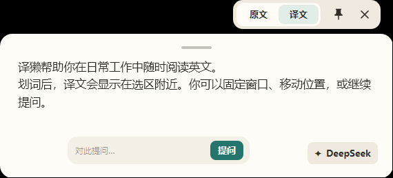
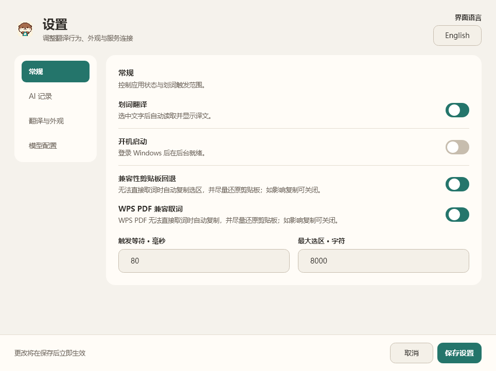
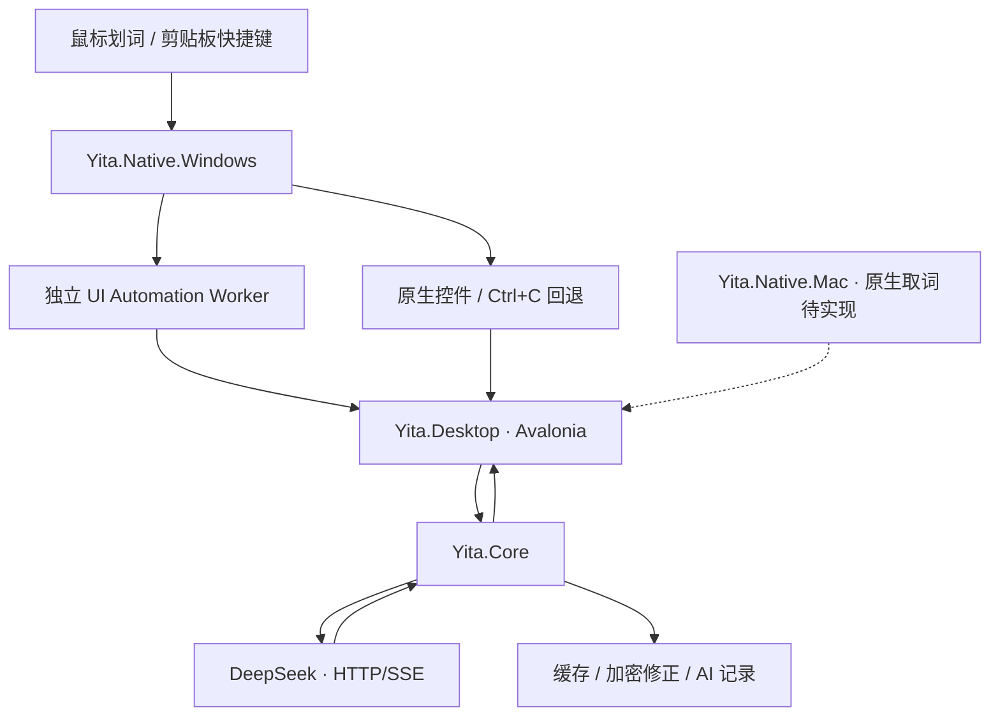

<p align="center">
  
</p>
<h1 align="center">译獭 · Yita</h1>
<p align="center">少一点打扰，多一点理解。<br>选中文字，让翻译停留在阅读发生的地方。</p>
<p align="center">
  <a href="https://github.com/2214331539/Yita/actions/workflows/cross-platform.yml"></a>
  <a href="LICENSE"></a>
  
  
  
  
</p>
<p align="center">
  <a href="#快速开始">快速开始</a> · <a href="#核心功能">核心功能</a> · <a href="#技术架构">技术架构</a> · <a href="#开发与测试">开发与测试</a> · <a href="#配置与隐私">配置与隐私</a> · <a href="#贡献">贡献</a>
</p>

Yita 是一个开源桌面划词翻译工具。在外部应用中用鼠标拖选文字后，Yita 读取选区，通过 DeepSeek 流式返回译文，在选区附近显示可移动、可缩放和可固定的阅读浮窗。支持网页、Markdown、编辑器、Office 文档以及具有可复制文本层的 PDF；实际兼容性取决于目标应用的选区接口、复制能力和系统权限。

**`main` 现已采用 C# + .NET 8 + Avalonia 架构。** Windows 取词、阅读浮窗、设置与 AI 辅助已实现，并完成本地功能验收。macOS 共享业务层与界面可以构建，但原生划词、权限和菜单栏功能尚未完成，不能视为已可用的 macOS 划词翻译产品。

> **源码与下载版本**：新架构当前从源码运行，尚未发布对应的 Setup。[GitHub Releases](https://github.com/2214331539/Yita/releases) 中已有的 `v0.8.4` 安装包属于旧 WPF 版本。更新 `main` 不会改变已上传的安装包，也不会自动更新用户电脑上的程序。

## 界面预览

<p align="center">
  
</p>

<details>
<summary>查看设置界面</summary>
<p align="center">
  
</p>
</details>

截图来自当前 Avalonia 界面的自动化渲染，使用演示文本；没有调用真实翻译服务或读取私人文档。实际字体和布局会受系统缩放、字体与主题影响。

## 核心功能

| 功能 | 当前实现 |
| --- | --- |
| 自动划词 | 在 Windows 外部应用中检测鼠标拖选，优先读取 UI Automation 与原生控件选区 |
| PDF 兼容取词 | WPS PDF 使用专用复制路径；其他无法直接读取的应用可使用通用 Ctrl+C 回退 |
| 流式翻译 | DeepSeek HTTP/SSE 流式响应，支持取消、超时、重试、并发限制与重复请求合并 |
| 阅读浮窗 | 原文/译文切换、内容自适应、长文滚动、拖动、缩放与固定多窗口 |
| 相对定位 | 保存浮窗相对本次选区的偏移，下次根据新选区、屏幕缩放和工作区定位 |
| AI 辅助 | 选区解释、代码分析、围绕内容追问与独立快速聊天 |
| 翻译偏好 | 翻译方向、表达风格、术语表、可选上下文、中英文字体与字号 |
| 缓存与修正 | 内存缓存、主动保存的加密翻译修正与相关示例复用 |
| AI 记录 | 可选 Markdown 解释/问答记录，手动保存、去重与按时间范围总结 |
| 设置与托盘 | 四页设置、中文/English 同步、启用/暂停、后台运行、开机启动与输入捕获修复 |

普通翻译缓存不作为永久历史保存。当前设置中的“AI 记录”管理解释与问答的 Markdown 记录；Core 中的通用历史接口保留给后续扩展。

## 快速开始

### 从源码运行 Windows 版本

需要 Git 和 [.NET 8 SDK](https://dotnet.microsoft.com/download/dotnet/8.0)。`global.json` 使用 `8.0.425` 作为构建基线，允许 .NET 8 内更新的稳定 SDK。

```powershell
git clone https://github.com/2214331539/Yita.git
cd Yita
dotnet restore Yita.CrossPlatform.sln
dotnet build Yita.CrossPlatform.sln -c Release --no-restore
dotnet run --project src/Yita.Desktop/Yita.Desktop.csproj -c Release --no-build
```

也可以使用 `git@github.com:2214331539/Yita.git` 克隆。Windows 构建会自动生成并复制独立的 `Yita.UIA.Worker.exe`，它必须与桌面程序配套运行。构建完成后，可双击 [Start-Yita-cross-platform.cmd](Start-Yita-cross-platform.cmd) 再次启动；当前开发机上的脚本兼容 `F:\DevTools\dotnet`。

使用依赖运行时的构建目录时，需要 .NET 8 运行时；Windows UIA helper 还需要 **.NET 8 Desktop Runtime**。不要只将单个 EXE 发给他人，也不要把该目录当成已经验收的自包含安装包。

### 首次配置

1. 从托盘退出旧 Yita 或其他翻译程序，避免快捷键冲突。
2. 打开设置，在右上角选择中文或 English。
3. 在“模型配置”中填写服务地址、模型和自己的 API Key，测试连接后保存。
4. 在普通网页或本地可复制的 PDF 中拖选英文，确认浮窗出现。

默认 DeepSeek 服务地址为 `https://api.deepseek.com`。模型以所用服务实际支持的名称为准，API 调用费用由该服务计费。仓库不提供 API Key；开发时可选择 Mock 提供器检查界面与流程，Mock 输出不是实际翻译。

### 常用操作

| 操作 | 方法 |
| --- | --- |
| 自动翻译 | 在目标应用中鼠标拖选文字 |
| 翻译剪贴板 | 先按 `Ctrl+C`，再按 `Ctrl+Shift+T`，或使用托盘菜单 |
| 切换原文/译文 | 点击阅读浮窗顶部的切换按钮 |
| 复制内容 | 在正文中选择文字后按 `Ctrl+C` 或使用右键菜单 |
| 移动浮窗 | 按住浮窗拖动区域移动，后续沿用相对选区的偏移 |
| 缩放浮窗 | 拖动右下角；悬停时显示斜向缩放指针 |
| 保留当前翻译 | 点击固定按钮，后续划词打开另一窗口 |
| AI 解释与追问 | 使用正文选区/右键菜单及浮窗底部输入区域 |
| 暂停与退出 | 使用托盘菜单；关闭设置页会保留后台进程 |

`Ctrl+Shift+T` 翻译当前剪贴板，不会替用户先复制。自动划词使用独立的取词链路，通用剪贴板回退与 WPS PDF 兼容取词当前默认启用，可在“常规”中关闭并保存。回退只向仍处于前台的原目标发送复制，尽可能恢复原剪贴板；不会自动向终端发送 Ctrl+C。

## 技术架构

新架构将业务、界面和操作系统能力分开。**C# 仍是主要语言，Avalonia 替代 WPF 作为主界面框架**；跨平台不意味着 Windows 原生接口可以直接在 macOS 使用，每个平台仍需要独立实现与验收。



| 模块 | 职责 | 状态 |
| --- | --- | --- |
| `Yita.Core` | 翻译提供器、流式协议、缓存与记录契约、设置、请求生命周期、选区模型与定位算法 | 已接入 |
| `Yita.Desktop` | Avalonia 设置页、阅读浮窗、解释/问答、主题、字体和桌面生命周期 | Windows 已实现；其他平台需验收 |
| `Yita.Native.Windows` | 鼠标钩子、全局快捷键、原生控件取词、剪贴板事务、托盘、开机启动、凭据与 DPAPI | 已实现 |
| `Yita.Native.Windows.UIA.Worker` | 在独立进程中访问第三方 UI Automation provider，隔离阻塞和崩溃 | 已实现 |
| `Yita.Native.Mac` | Keychain、加密修正记录、helper 协议与权限入口；后续 AXUIElement、Cmd+C 与输入捕获 | 部分实现，原生取词待完成 |

### 实现策略

- **复用原版业务**：`Yita.Core/Parity/OriginalBehavior.props` 编译链接原版中与 WPF 无关的提供器、提示词、重试、缓存、记录与设置代码。桌面入口使用 `ReferenceTranslationRuntime` 编排这些机制，保留原版行为的回归测试。
- **重建界面**：Avalonia 渲染设置、浮窗与问答。设置布局以原版 XAML 为参考，主题、字体和交互按原版还原；主界面不启动旧 WPF 应用。
- **隔离原生故障**：低级鼠标钩子只入队事件，取词在回调外执行；UIA 由独立 helper 通过标准输入/输出交换结构化消息，故障后继续回退。
- **保护阅读和复制**：验证原目标、焦点及剪贴板归属，等待 OLE 格式稳定，在不覆盖后续用户复制的前提下恢复原内容。密码控件、终端和无法完整保存的剪贴板会停止自动复制。
- **控制异步状态**：新选区取消旧请求，并通过请求版本避免迟到响应覆盖当前窗口；固定窗口独立保留自己的会话。

Windows UIA helper 因系统 API 引用而使用 WindowsDesktop/WPF 运行时，但不承载产品 UI。共享 Core 与 Avalonia 主项目仍以 `net8.0` 为目标。完整职责、取词路径、配置与平台边界见 [架构说明](docs/ARCHITECTURE.md)。

### 仓库结构

```text
Yita.CrossPlatform.sln                当前主解决方案
src/
  Yita.Core/                         共享业务与数据契约
    Parity/                          原版业务链接与当前翻译运行时
    Selection/                       平台无关选区模型与读取管线
    Placement/                       浮窗定位与相对偏移
    Settings/                        偏好设置与存储接口
    Translation/                     通用流式翻译、缓存与历史接口
  Yita.Desktop/                      Avalonia 设置、浮窗与问答
  Yita.Native.Windows/               Windows 原生功能
  Yita.Native.Windows.UIA.Worker/    独立 UI Automation helper
  Yita.Native.Mac/                   macOS 原生适配边界
  Yita.App/                          保留的 WPF 源码与共享业务来源
tests/
  Yita.Core.Tests/                   共享合约与可靠性
  Yita.Core.Parity.Tests/            原版业务与迁移运行时回归
  Yita.Desktop.Tests/                Avalonia Headless 交互与布局
  Yita.Native.Windows.Tests/         Windows 适配器策略与 ABI
  Yita.Tests/                        保留的 WPF 回归测试
tools/                              原生取词 smoke 与原版截图工具
docs/                               架构、开发计划和验收说明
assets/branding/yita/                品牌形象与图标
scripts/ · packaging/windows/       旧 WPF 打包流程与开发辅助脚本
```

## 平台与分支

| 平台 | 当前能力 |
| --- | --- |
| Windows | 主开发和验收平台，支持取词、翻译、浮窗、托盘和设置 |
| macOS | Core 与 Avalonia 界面可构建；AX 取词、Cmd+C、权限和菜单栏尚未接入，不提供完整安装版 |
| Linux | 不属于当前产品交付范围，没有原生取词适配器 |

| 分支 | 用途 |
| --- | --- |
| `main` | 当前 C#/.NET/Avalonia 架构的主开发分支 |
| `codex/csharp-wpf-legacy` | 切换前 GitHub main 的完整 Yita WPF 快照，保留旧源码、README 与打包流程 |
| `codex/csharp-wpf-upstream-baseline` | 切换前本地 main 的上游 WPF 基线，单独保留其历史 |
| `codex/platform-host-services` | 共享宿主、单实例、设置版本迁移和 Mac 安全存储开发，尚未合入 main |

旧 WPF 与新 Avalonia 都使用 C#，旧分支名中的 `csharp-wpf` 用来区分界面与原生组织方式。已有版本标签与 Release 资产保留，不重写历史。

早期迁移和 Windows 还原的提交均已包含在 `main` 中。历史分支保持参考用途；后续功能从最新 `main` 创建独立分支，验收后通过 Pull Request 合入。

## 开发与测试

```powershell
dotnet build Yita.CrossPlatform.sln -c Release
dotnet test Yita.CrossPlatform.sln -c Release --no-build --no-restore
```

Windows 上还可以验证保留的原版业务与界面：

```powershell
dotnet test Yita.sln -c Release
dotnet run --project tools/Yita.WindowsSmoke/Yita.WindowsSmoke.csproj -c Release
```

原生 smoke 需要可交互桌面，并且应先退出正在运行的 Yita，释放全局快捷键。它使用独立测试编辑器，保存并恢复剪贴板，不请求在线服务、不写产品设置。修改源码后重新构建，再退出并启动新进程；正在运行的 EXE 不会自动热更新。

平台宿主分支还提供不依赖 GUI 权限的跨进程单实例与唤醒检查，使用临时目录，不修改产品设置或剪贴板：

```powershell
dotnet run --project tools/Yita.PlatformSmoke/Yita.PlatformSmoke.csproj -c Release
```

维护者已确认朋友电脑上的旧 WPF 安装版安装与取词通过。新版 Avalonia Setup 仍未生成，按当前开发安排暂缓打包，优先完善平台宿主和 macOS 原生链路；两者验收记录分开。

GitHub Actions 的 `Cross-platform architecture` 工作流在 Windows/macOS runner 上构建当前解决方案并运行测试；`Legacy WPF regression` 在 Windows 上检查保留的 WPF 解决方案。macOS 构建通过只能证明共享代码可构建，不能证明 macOS 划词功能已实现。

平台宿主功能分支还会在 Mac 构建 Swift 权限/AX helper，并验证 C#/Swift JSON 通信、范围取词策略和结构化选区结果。AX 读取代码已实现，但 Desktop 自动触发、Cmd+C 回退和屏幕坐标转换仍待完成。CI 的 self-test 不请求桌面权限或读取真实选区；详细接口、开发签名和验证边界见 [Mac helper 协议](docs/MAC_HELPER_PROTOCOL.md)。

下一阶段的交付顺序、平台边界和发布验收标准见 [跨平台产品开发路线图](docs/CROSS_PLATFORM_ROADMAP.md)。已有结果见 [Windows 验收说明](docs/WINDOWS_AVALONIA_ACCEPTANCE.md)；[还原开发计划](docs/WINDOWS_AVALONIA_PARITY_PLAN.md) 和 [首次迁移计划](docs/CROSS_PLATFORM_MIGRATION_PLAN.md) 保留为历史记录。

### 安装包与更新

当前 Avalonia main 尚未接入经过验收的自包含 Setup 流程。`Build-Setup.ps1`、`Publish.ps1` 和旧 `release.yml` 面向 WPF；工作流已增加检查，阻止从包含 Avalonia 项目的新标签误发布旧架构安装包。需要生成旧版安装包时，应检出 `codex/csharp-wpf-legacy` 并使用该分支的说明。

下一步分发需要为 `Yita.Desktop` 和 Windows UIA helper 一起完成自包含发布、安装/升级/卸载验证与签名策略。当前没有应用内自动更新器，源码更新、GitHub Release 和安装版更新是三个独立步骤。

## 配置与隐私

| 内容 | 当前 Windows 位置或处理方式 |
| --- | --- |
| 偏好与相对偏移 | `%LOCALAPPDATA%\Yita\desktop-settings.json` |
| API Key | Windows 凭据管理器，标识 `Yita:DeepSeekApiKey`，不写设置 JSON |
| 主动保存的翻译修正 | `%LOCALAPPDATA%\Yita\desktop-translation-memory.dat`，使用当前用户 DPAPI 加密 |
| 运行健康日志 | `%LOCALAPPDATA%\Yita\desktop-runtime-health.log` |
| 普通翻译缓存 | 进程内存，退出后清空 |
| AI 记录 | 用户选择的目录，明文 Markdown，自动保存默认关闭 |
| 在线请求 | 选区发送给所配置的 API 服务；启用上下文后也可能发送周边段落 |

首次启动可导入旧 WPF 阅读偏好，保存到新文件；不沿用旧版开机启动或 AI 记录目录。旧 WPF 使用 `settings.json` 和 `Yita/DeepSeekApiKey`，当前程序使用独立设置与凭据标识。

平台宿主功能分支新增设置格式版本和迁移备份；损坏、不可读或由更高版本写入的配置会禁止覆盖。Mac 凭据改用原生 Keychain API，主动保存的修正使用 Keychain 密钥保护的 AES-GCM；这些代码仍需真实 Mac 授权与运行验收，没有明文持久化回退。具体迁移、密钥与文件规则见 [架构说明](docs/ARCHITECTURE.md)。

Yita 是本地客户端，默认在线翻译不是离线模型。开启个人术语或修正示例时，请求可能附带相关内容。分享日志、记录或截图前请脱敏，不要提交 API Key 或私人文档。

## 已知限制

- 无 OCR；扫描 PDF、图片文字和禁止复制内容不在当前支持范围内。
- 自动触发主要针对鼠标拖选，不覆盖所有键盘扩选或双击选词场景。
- 不承诺所有应用兼容；管理员权限窗口、受保护控件和不同应用版本会影响取词。
- 不同 DPI、字体渲染与多屏状态仍需验收；Avalonia 与 WPF 的栅格化结果不保证逐像素一致。
- Zotero 桥接仍为实验代码，不能视为已验证支持。
- 没有完整 macOS 划词安装版，也没有新架构自动更新与 Setup Release。

划词无反应时，先在普通网页确认划词开关与兼容回退已开启；再尝试主动复制后使用 `Ctrl+Shift+T`。若正常复制受到影响，暂停划词并关闭两个兼容取词开关。可通过托盘修复输入捕获或复制诊断，反馈时附目标应用与版本、系统版本和复现步骤。

## 贡献

通过 [Issues](https://github.com/2214331539/Yita/issues) 报告问题或提出建议。Pull Request 默认提交到 `main`，请运行当前解决方案的构建与测试；取词、剪贴板和请求生命周期修改应包含针对实际风险的回归验证，UI 修改应检查中英文、长文、缩放与加载/错误状态。

新增平台能力应实现原生适配边界，保持 Core 不依赖平台 UI。macOS 后续工作包括 AXUIElement、Cmd+C 回退、选区坐标、Accessibility 权限、全局输入、菜单栏 helper 与真实设备验收。

## 许可证与来源

Yita 包含源自 [InstantTranslate](https://github.com/franklai-rise/InstantTranslate) v0.7.3 的代码。当前架构采用共享 Core、Avalonia 界面和平台原生适配器，部分通用业务逻辑与 Windows 取词机制沿用并适配了原有实现。

Yita 自有修改采用 [MIT License](LICENSE)。上游版权与完整许可保留在 [LICENSES/InstantTranslate-MIT.txt](LICENSES/InstantTranslate-MIT.txt)；字体和其他第三方声明见 [NOTICE.md](NOTICE.md)。品牌素材见 [assets/branding/yita/v1](assets/branding/yita/v1)，包含 PNG 与 ICO，不是 SVG 矢量源文件。
